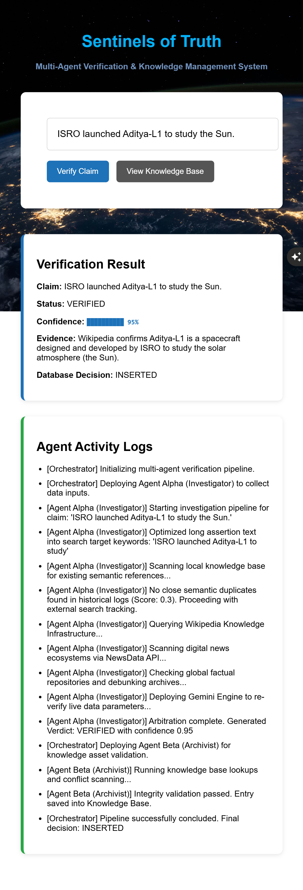
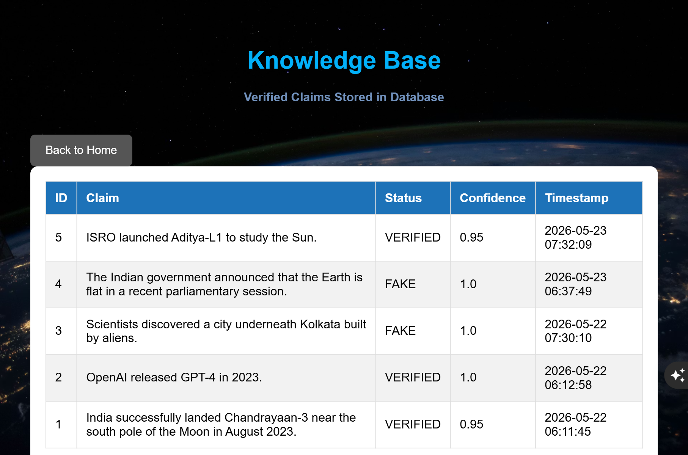

# Sentinels of Truth

Sentinels of Truth is a multi-agent AI-powered fact verification and knowledge management system designed to analyze news claims, detect misinformation, and maintain a structured verification database.

The system combines semantic similarity search, live evidence collection, fact-check APIs, and LLM-based reasoning to evaluate whether a claim is verified, fake, uncertain, or contradictory to existing knowledge.

## GitHub Repository

https://github.com/tjayush/sentinels-of-truth

---

# Features

- Multi-agent verification architecture
- Semantic similarity matching using stored claim memory
- Wikipedia-based evidence collection
- Real-time news verification
- Fact-check archive lookup
- Gemini-powered reasoning engine
- SQLite knowledge base management
- Contradiction detection and flagging
- Interactive Flask web interface
- Agent activity tracking logs
- Duplicate claim prevention
- Human-readable verification reports
- Automatic database decision handling

---

# Application Screenshots

## Home Dashboard

The main verification dashboard where users can submit claims, view verification results, confidence scores, evidence summaries, and agent activity logs.



---

## Knowledge Base Dashboard

The database view showing stored verified/fake claims along with confidence scores and timestamps.



---

# System Architecture

The platform follows a collaborative multi-agent workflow.

---

## Agent Alpha — Investigator

Responsible for:

- Collecting external evidence
- Searching Wikipedia
- Searching recent news articles
- Querying fact-check databases
- Performing semantic similarity analysis
- Optimizing long claims into search-friendly queries
- Sending compiled evidence to the reasoning engine

---

## Agent Beta — Archivist

Responsible for:

- Evaluating verification results
- Managing database storage operations
- Detecting contradictions with historical records
- Preventing duplicate entries
- Flagging suspicious conflicts for human review
- Handling uncertain claims safely

---

## Orchestrator

Responsible for:

- Managing communication between agents
- Maintaining shared runtime state
- Coordinating the full verification pipeline
- Preventing pipeline crashes through safe fallback handling

---

# Core Logic Used in the System

The project uses a layered verification workflow instead of relying on a single API response.

---

## Step 1 — Claim Processing

User submits a news headline or article.

The system:

- Cleans the text
- Detects long/noisy inputs
- Creates optimized search queries for APIs

---

## Step 2 — Semantic Memory Check

The system compares the incoming claim against previously stored claims using semantic similarity matching.

Possible outcomes:

- Similar claim already exists
- Contradictory historical claim exists
- Completely new claim detected

---

## Step 3 — Evidence Collection

The Investigator Agent collects evidence from:

- Wikipedia summaries
- Recent news articles
- Fact-check databases

Evidence is compressed and structured before reasoning.

---

## Step 4 — AI Reasoning Engine

The Gemini reasoning engine evaluates:

- Claim consistency
- Evidence agreement
- Fact-check alignment
- Similarity confidence

The engine generates:

- Verification status
- Confidence score
- Evidence summary

---

## Step 5 — Database Governance

The Archivist Agent decides whether to:

| Decision | Meaning |
|---|---|
| INSERTED | Claim stored in database |
| DISCARD | Duplicate claim ignored |
| FLAGGED | Contradiction detected |
| REJECTED | Fake claim recorded |
| UNCERTAIN | Not enough evidence |

---

# Project Structure

```bash
sentinels-of-truth/
│
├── screenshots/
│   ├── home.png
│   └── claims.png
│
├── app.py
│
├── agents/
│   ├── investigator.py
│   ├── archivist.py
│   └── orchestrator.py
│
├── database/
│   ├── db.py
│   └── truth.db
│
├── tools/
│   ├── wikipedia_search.py
│   ├── factcheck_api.py
│   ├── news_search.py
│   ├── semantic_similarity.py
│   └── gemini_reasoner.py
│
├── templates/
│   ├── index.html
│   └── claims.html
│
├── static/
│   ├── style.css
│   └── script.js
│
├── requirements.txt
│
└── README.md
```

---

# Technologies Used

- Python
- Flask
- SQLite
- Gemini API
- Wikipedia API
- NewsData API
- HTML
- CSS
- JavaScript

---

# Installation

## Clone the Repository

```bash
git clone https://github.com/tjayush/sentinels-of-truth.git
```

---

## Install Dependencies

```bash
pip install -r requirements.txt
```

---

# Running the Project

```bash
python app.py
```

Open in browser:

```text
http://127.0.0.1:5000
```

---

# Example Claims

## Verified Claims

- India successfully landed Chandrayaan-3 near the south pole of the Moon in 2023.
- The ICC Men's Cricket World Cup 2023 final was hosted in Ahmedabad.
- ISRO launched Aditya-L1 to study the Sun.

---

## Fake Claims

- Archaeologists discovered a secret underground tunnel connecting India and Sri Lanka.
- India found alien life on Mars.
- A hidden ancient city was discovered beneath the Indian Ocean.

---

# Database Design

## claims table

Stores:

- Verified claims
- Fake claims
- Confidence scores
- Evidence summaries
- Timestamps

---

## flagged_claims table

Stores:

- Contradictory claims
- Human review cases
- Conflict reasons

---

# Future Improvements

- Better hallucination reduction
- Advanced contradiction detection
- Vector database integration
- Multi-language verification
- Source credibility scoring
- Explainable reasoning visualization
- Real-time streaming verification
- Improved evidence ranking

---

# Disclaimer

This project is an experimental AI-assisted fact verification system and should not be treated as an absolute authority for sensitive or high-risk decision making.

Human review is recommended for ambiguous or conflicting claims.

---

# Author

## Ayushman Sarkar

B.Tech CSE Student

### Research Interest Areas

- Artificial Intelligence
- Explainable AI
- Cybersecurity
- Multi-Agent Systems
- Misinformation Detection
